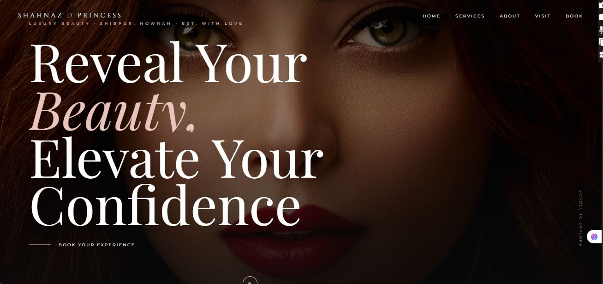
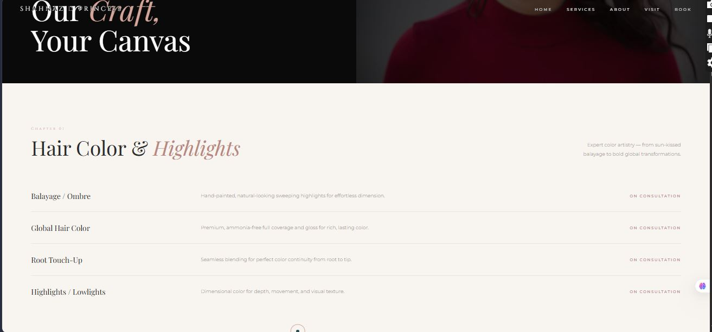
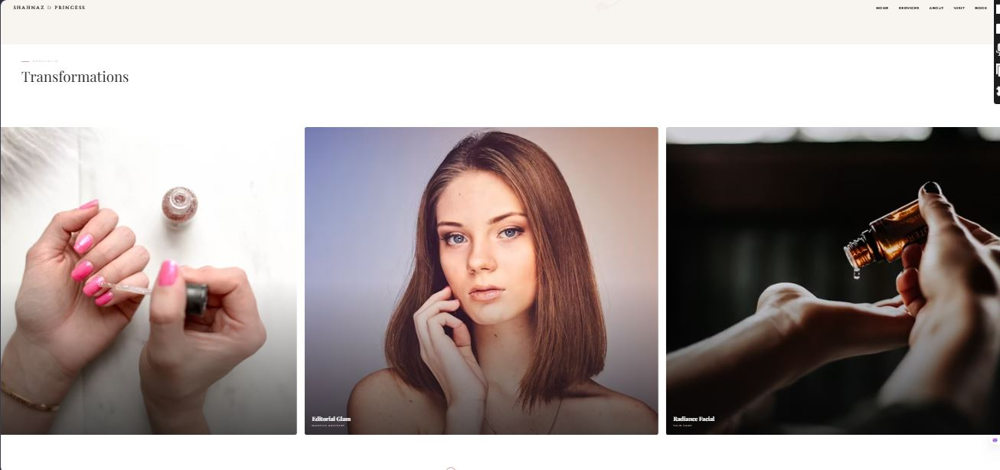
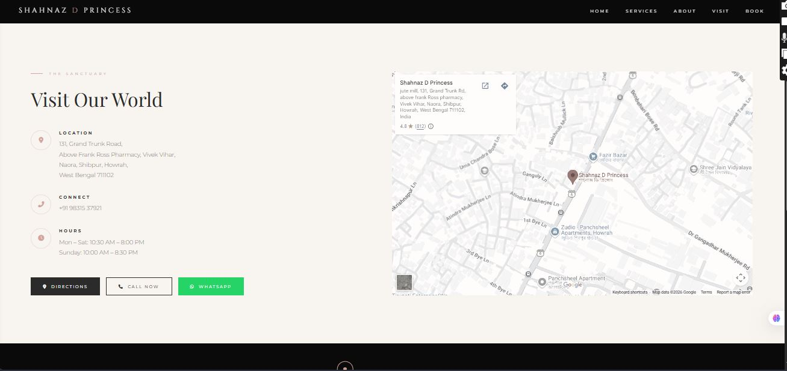

# 💇 Shahnaz D Princess Salon Website

A premium, modern, and fully responsive salon website concept designed for **Shahnaz D Princess Salon**. This project was created as a business demo to showcase how a professional website can enhance a salon's online presence and customer experience.

> **Note:** This is an independent demo website created for portfolio and client presentation purposes.

---

## 🌐 Live Demo

🔗 **Website:** https://sayantani-aiml.github.io/shehnaz-d-princess/

---

## 📸 Screenshots

### 🏠 Home Page



### 💅 Services Section



### 🖼️ Gallery



### 📞 Contact Section



---

## ✨ Features

* 💎 Premium & Elegant UI
* 📱 Fully Responsive Design
* ✨ Smooth Scroll Animations
* 🧭 Modern Navigation Bar
* 💇 Service Showcase
* 🖼️ Image Gallery
* 📍 Google Maps Integration
* 📞 Contact & Call-to-Action Section
* ⚡ Fast Loading Performance

---

## 🛠️ Tech Stack

* HTML5
* CSS3
* JavaScript

---

## 📂 Project Structure

```text
📁 Shahnaz-D-Princess-Salon
│── index.html
│── styles.css
│── script.js
│── images/
└── README.md
```

---

## 🚀 Getting Started

1. Clone the repository

```bash
git clone https://github.com/sayantani-aiml/shehnaz-d-princess.git
```

2. Open the project folder.

3. Launch `index.html` in your browser.

---

## 📚 What I Learned

* Responsive Web Design
* Modern Landing Page Design
* CSS Animations & Transitions
* Layout Structuring
* UI/UX Principles
* Client-focused Website Development

---

## 🔮 Future Improvements

* Online Appointment Booking
* WhatsApp Integration
* Customer Testimonials
* Dark Mode
* Backend Integration
* Admin Dashboard

---

## ⚠️ Disclaimer

This website is an independent portfolio project created as a demo for **Shahnaz D Princess Salon**. It is intended solely for showcasing web development skills and is not an official website unless adopted by the business.

---

## 👩‍💻 Developed By

**Sayantani Das**

🎓 B.Tech CSE (AI & ML) | Institute of Engineering & Management (IEM)

💻 AI-Assisted Frontend Web Developer

🎨 Co-Founder | Design Craft Studio

⭐ If you like this project, consider giving it a star!
